```{r setup}
#| echo: false
#| include: false
library(pacman)
p_load(tidyverse)

knitr::opts_chunk$set(dev.args = list(bg = 'transparent'))
```

## Before We Begin... {visibility="hidden"}
::: {style='text-align: center;'}
*What is your level of experience with data visualizations?*
:::

```{r quiz1-qr}
#| echo: false
#| include: false

p_load(qrcode)

quiz1 <- qr_code('https://strawpoll.com/w4nWWpQXlnA')

png(filename = 'quiz1.png', bg = 'transparent')
par(mar = c(0, 0, 0, 0), oma = c(0, 0, 0, 0), xaxs = 'i', yaxs = 'i')
plot(quiz1, col = c('#282a36', '#f8f8f2'), main = NA)
dev.off()
```

{fig-align="center" height=20%}

## Pulse Check Results {visibility="hidden"}

::: {.notes}
:::

:::: {.columns}
::: {.column width=20%}
::: {style='text-align: center;'}
{fig-align="center" height=20%}
:::
:::

::: {.column width=80%}
<div class="strawpoll-embed" id="strawpoll_w4nWWpQXlnA" style="height: 600px; max-width: 640px; height: 100%; width: 100%; margin: 0 auto; display: flex; flex-direction: column;"><iframe title="StrawPoll Embed" id="strawpoll_iframe_w4nWWpQXlnA" src="https://strawpoll.com/embed/w4nWWpQXlnA/results" style="position: static; visibility: visible; display: block; width: 100%; flex-grow: 1;" scrolling = "no" frameborder="0" allowfullscreen allowtransparency>Loading...</iframe><script nonce="MjVlOTZlZjc4YTdkMDcxNGUwYjA2ZDBmODI3ZWJjMWNiZTljNGM5NQ==" async src="https://cdn.strawpoll.com/dist/widgets.js" charset="utf-8"></script></div>
:::
::::

## Session Overview

::: {.notes}
at a high level, how our brains process and then make sense of visual stimuli
:::

:::: {.columns}

::: {.column width='45%'}
::: {.fragment .semi-fade-out fragment-index='3'}
<u>What we *[WON'T]{.highlight-red}* focus on</u>

::: {.fragment fragment-index='1'}
- Data sourcing/wrangling/mining
  - Extract-Transform-Load ([ETL](https://www.databricks.com/discover/etl))
  - Cross Industry Standard Process for Data Mining ([CRISP-DM](https://www.datascience-pm.com/crisp-dm-2/))
:::

::: {.fragment fragment-index='2'}
- Programming or software tutorials
  - [R](https://rstudio-education.github.io/hopr/) and [Python](https://nostarch.com/python-crash-course-3rd-edition)
  - [Power Query M](https://learn.microsoft.com/en-us/powerquery-m/) formula language
  - Data Analysis Expressions ([DAX](https://learn.microsoft.com/en-us/dax/))
:::
:::
:::

::: {.column width='10%'}
:::

::: {.column width='45%'}
<u>What we *[WILL]{.highlight-green}* focus on</u>

::: {.fragment fragment-index='3'}
- Data viz theory
  - Perceptual rankings
  - Gestalt principles
  - Preattentive attributes
:::

::: {.fragment  fragment-index='4'}
- Data viz best practices
  - What makes visualizations good (and not-so-good)
:::

::: {.fragment fragment-index='5'}
- Types of visualizations and their use cases
  - Advancement-specific examples
:::
:::

::::

# Data Viz Theory

## So...Why Visualizations?

Why not just stick to Excel sheets or tables with raw numbers?

. . .

### Anscombe's Quartet

::: {.notes}
four datasets that have nearly identical simple descriptive statistics, yet have very different distributions and appear very different when graphed
:::

::: {.fragment}
:::: {.columns}

::: {.column width=70%}
- Published in 1973 by English statistician Francis Anscombe
- The Quartet is comprised of 4 sets of paired x- and y-values
  - *x*: horizontal axis
  - *y*: vertical axis
- Let's take a look at the data and see what we observe!
:::

::: {.column width=30%}
::: {style='text-align: center;'}
)](./Francis_Anscombe.jpeg){fig-align="center"}
:::
:::
::::
:::

## Anscombe's Quartet
```{r anscombe-obs-tables}
#| echo: false
#| include: false

p_load(gt, gtExtras)

anscombe_data <- anscombe %>%
  mutate(obs = row_number()) %>%
  select(9, 1, 5, 2, 6, 3, 7, 4, 8)

anscombe_table <- gt(anscombe_data) %>%
  tab_header(
    title = 'Observations'
  ) %>%
  tab_spanner(
    label = 'Set 1',
    columns = ends_with('1')
  ) %>%
  tab_spanner(
    label = 'Set 2',
    columns = ends_with('2')
  ) %>%
  tab_spanner(
    label = 'Set 3',
    columns = ends_with('3')
  ) %>%
  tab_spanner(
    label = 'Set 4',
    columns = ends_with('4')
  ) %>%
  fmt_number(
    columns = c(2:9),
    decimals = 2
  ) %>%
  cols_label(
    obs = 'Obs. No.',
    x1 = 'x',
    y1 = 'y',
    x2 = 'x',
    y2 = 'y',
    x3 = 'x',
    y3 = 'y',
    x4 = 'x',
    y4 = 'y'
  ) %>%
  cols_align(
    align = 'center'
  ) %>%
  tab_options(
    table.font.color.light = '#f8f8f2',
    table.background.color = '#282a36'
  ) %>%
  tab_style(
    style = cell_text(weight = 'bold'),
    locations = list(
      cells_body(columns = 'obs'),
      cells_column_labels(columns = 'obs')
    )
  ) %>%
  tab_style(
    style = cell_text(color = '#e2cffc', weight = 'bold'),
    locations = cells_column_spanners(spanners = ends_with('1'))
  ) %>%
  tab_style(
    style = cell_text(color = '#f1fa8c', weight = 'bold'),
    locations = cells_column_spanners(spanners = ends_with('2'))
  ) %>%
  tab_style(
    style = cell_text(color = '#ff79c6', weight = 'bold'),
    locations = cells_column_spanners(spanners = ends_with('3'))
  ) %>%
  tab_style(
    style = cell_text(color = '#50fa7b', weight = 'bold'),
    locations = cells_column_spanners(spanners = ends_with('4'))
  ) %>%
  tab_style(
    style = cell_text(color = '#ffb86c'),
    locations = cells_column_labels(columns = starts_with('x'))
  ) %>%
  tab_style(
    style = cell_text(color = '#8be9fd'),
    locations = cells_column_labels(columns = starts_with('y'))
  )

anscombe_table_x1 <- anscombe_table %>%
  tab_style(
    style = cell_text(color = 'rgba(248, 248, 242, 0.3)', weight = 'lighter'),
    locations = list(
      cells_body(columns = x4),
      cells_body(columns = starts_with('y')),
      cells_column_labels(columns = x4),
      cells_column_labels(columns = starts_with('y')),
      cells_column_spanners(spanners = 'Set 4')
    )
  ) %>%
  tab_style(
    style = cell_text(color = 'rgba(248, 248, 242, 0.3)', weight = 'normal'),
    locations = list(
      cells_body(columns = 'obs'),
      cells_column_labels(columns = 'obs')
    )
  ) %>%
  tab_style(
    style = cell_text(color = '#ffb86c', weight = 'bold'),
    locations = cells_body(columns = c(x1, x2, x3))
  )

anscombe_table_x2 <- anscombe_table %>%
  tab_style(
    style = cell_text(color = 'rgba(248, 248, 242, 0.3)', weight = 'lighter'),
    locations = list(
      cells_body(columns = c(x1, x2, x3)),
      cells_body(columns = starts_with('y')),
      cells_column_labels(columns = c(x1, x2, x3)),
      cells_column_labels(columns = starts_with('y')),
      cells_column_spanners(spanners = c('Set 1', 'Set 2', 'Set 3'))
    )
  ) %>%
  tab_style(
    style = cell_text(color = 'rgba(248, 248, 242, 0.3)', weight = 'normal'),
    locations = list(
      cells_body(columns = 'obs'),
      cells_column_labels(columns = 'obs')
    )
  ) %>%
  tab_style(
    style = cell_text(color = '#d33682', weight = 'normal'),
    locations = cells_body(columns = 'obs', rows = 8)
  ) %>%
  tab_style(
    style = cell_text(color = '#ffb86c', weight = 'bold'),
    locations = cells_body(columns = x4)
  ) %>%
  tab_style(
    style = cell_text(color = '#d33682', weight = 'bold'),
    locations = cells_body(columns = x4, rows = x4 == 19)
  )

anscombe_table_y <- anscombe_table %>%
  tab_style(
    style = cell_text(color = 'rgba(248, 248, 242, 0.3)', weight = 'lighter'),
    locations = list(
      cells_body(columns = everything()),
      cells_column_labels(columns = everything()),
      cells_column_spanners(spanners = c('Set 1', 'Set 2'))
    )
  ) %>%
  tab_style(
    style = cell_text(color = 'rgba(248, 248, 242, 0.3)', weight = 'normal'),
    locations = list(
      cells_body(columns = 'obs'),
      cells_column_labels(columns = 'obs')
    )
  ) %>%
  tab_style(
    style = cell_text(color = '#d33682', weight = 'normal'),
    locations = cells_body(columns = 'obs', rows = c(3, 8))
  ) %>%
  tab_style(
    style = cell_text(color = '#8be9fd'),
    locations = cells_column_labels(columns = c(y3, y4))
  ) %>%
  tab_style(
    style = cell_text(color = '#d33682', weight = 'bold'),
    locations = list(
      cells_body(columns = y3, rows = y3 == max(y3)),
      cells_body(columns = y4, rows = y4 == max(y4))
    )
  )

anscombe_table_gray <- anscombe_table %>%
  tab_style(
    style = cell_text(color = 'rgba(248, 248, 242, 0.3)', weight = 'lighter'),
    locations = list(
      cells_body(columns = everything()),
      cells_column_labels(columns = everything()),
      cells_column_spanners(spanners = everything())
    )
  ) %>%
  tab_style(
    style = cell_text(color = 'rgba(248, 248, 242, 0.3)', weight = 'normal'),
    locations = list(
      cells_body(columns = 'obs'),
      cells_column_labels(columns = 'obs')
    )
  )
```

```{r anscombe-sum-tables}
anscombe_tidy <- anscombe %>%
  pivot_longer(
    everything(),
    names_to = c('.value', 'Set'),
    names_pattern = '(.)(.)'
  )

anscombe_summary <- anscombe_tidy %>%
  group_by(Set) %>%
  summarize(
    x_mean = mean(x),
    x_var = var(x),
    x_sd = sd(x),
    y_mean = mean(y),
    y_var = var(y),
    y_sd = sd(y),
    corr = cor(x, y),
    r_sq = summary(lm(y ~ x))$r.squared
  )

anscombe_sumtable <- gt(anscombe_summary) %>%
  tab_header(
    title = 'Summary Statistics'
  ) %>%
  tab_spanner(
    label = 'x',
    columns = starts_with('x')
  ) %>%
  tab_spanner(
    label = 'y',
    columns = starts_with('y')
  ) %>%
  fmt_number(
    columns = c(2:9),
    decimals = 2
  ) %>%
  cols_label(
    x_mean = 'Mean',
    x_var = 'Variance',
    x_sd = 'SD',
    y_mean = 'Mean',
    y_var = 'Variance',
    y_sd = 'SD',
    corr = 'Correlation',
    r_sq = 'R\u00b2'
  ) %>%
  cols_align(
    align = 'center'
  ) %>%
  tab_options(
    table.font.color.light = '#f8f8f2',
    table.background.color = '#282a36',
    table.margin.left = px(50)
  ) %>%
  tab_style(
    style = cell_text(weight = 'bold'),
    locations = list(
      cells_body(columns = 'Set'),
      cells_column_labels(columns = 'Set')
    )
  ) %>%
  tab_style(
    style = cell_text(color = '#e2cffc'),
    locations = cells_body(columns = 'Set', rows = Set == 1)
  ) %>%
  tab_style(
    style = cell_text(color = '#f1fa8c'),
    locations = cells_body(columns = 'Set', rows = Set == 2)
  ) %>%
  tab_style(
    style = cell_text(color = '#ff79c6'),
    locations = cells_body(columns = 'Set', rows = Set == 3)
  ) %>%
  tab_style(
    style = cell_text(color = '#50fa7b'),
    locations = cells_body(columns = 'Set', rows = Set == 4)
  ) %>%
  tab_style(
    style = cell_text(color = '#ffb86c', weight = 'bold'),
    locations = cells_column_spanners(spanners = starts_with('x'))
  ) %>%
  tab_style(
    style = cell_text(color = '#8be9fd', weight = 'bold'),
    locations = cells_column_spanners(spanners = starts_with('y'))
  )

anscombe_sumtable_gray <- anscombe_sumtable %>%
  tab_style(
    style = cell_text(color = 'rgba(248, 248, 242, 0.3)', weight = 'lighter'),
    locations = list(
      cells_body(columns = everything()),
      cells_column_labels(columns = everything()),
      cells_column_spanners(spanners = everything())
    )
  ) %>%
  tab_style(
    style = cell_text(color = 'rgba(248, 248, 242, 0.3)', weight = 'normal'),
    locations = list(
      cells_body(columns = 'Set'),
      cells_column_labels(columns = 'Set')
    )
  )

anscombe_sumtable_highlights <- anscombe_sumtable %>%
  tab_style(
    style = cell_text(color = 'rgba(248, 248, 242, 0.3)', weight = 'lighter'),
    locations = list(
      cells_body(columns = c(2:9)),
      cells_column_labels(columns = everything())
    )
  ) %>%
  tab_style(
    style = cell_text(color = 'rgba(248, 248, 242, 0.3)', weight = 'normal'),
    locations = list(
      cells_column_labels(columns = 'Set')
    )
  ) %>%
  tab_style(
    style = cell_text(weight = 'normal'),
    locations = cells_body(columns = 'Set')
  ) %>%
  tab_style(
    style = cell_text(color = '#ffb86c', weight = 'bold'),
    locations = cells_body(columns = starts_with('x'))
  ) %>%
  tab_style(
    style = cell_text(color = '#8be9fd', weight = 'bold'),
    locations = cells_body(columns = starts_with('y'))
  ) %>%
  tab_style(
    style = cell_text(color = '#f8f8f2', weight = 'bold'),
    locations = cells_body(columns = c(corr, r_sq))
  )
```

```{r anscombe-groups}
anscombe_grp <- gt_two_column_layout(list(anscombe_table, anscombe_sumtable))
anscombe_grp_x1 <- gt_two_column_layout(list(
  anscombe_table_x1,
  anscombe_sumtable_gray
))
anscombe_grp_x2 <- gt_two_column_layout(list(
  anscombe_table_x2,
  anscombe_sumtable_gray
))
anscombe_grp_y <- gt_two_column_layout(list(
  anscombe_table_y,
  anscombe_sumtable_gray
))
anscombe_grp_sum <- gt_two_column_layout(list(
  anscombe_table_gray,
  anscombe_sumtable_highlights
))
```

::: {.notes}
- On the left we can see the dataset
- On the right we have summary stats: averages, variance, and standard deviation for the x and y values, as well as correlation and R-squared, which is a measure that tells you how much of the variation in your data is explained by your variables
- What jumps out?
:::

::: {.r-stack}
::: {.fragment .fade-out fragment-index='0'}
```{r anscombe-grp}
anscombe_grp
```
:::

::: {.fragment .fade-in-then-out fragment-index='0'}
```{r anscombe-grp-x1}
anscombe_grp_x1
```
:::

::: {.fragment .fade-in-then-out}
```{r anscombe-grp-x2}
anscombe_grp_x2
```
:::

::: {.fragment .fade-in-then-out}
```{r anscombe-grp-y}
anscombe_grp_y
```
:::

::: {.fragment .fade-in}
```{r anscombe-grp-sum}
anscombe_grp_sum
```
:::
:::

## Anscombe's Quartet
```{r anscombe-ggplot}
#| echo: false
#| include: false

anscombe_plt <- ggplot(anscombe_tidy, aes(x = x, y = y, color = Set)) +
  geom_point(size = 3) +
  scale_color_manual(
    values = c('#e2cffc', '#f1fa8c', '#ff79c6', '#50fa7b')
  ) +
  geom_smooth(method = 'lm', se = FALSE, color = '#d33682', formula = y ~ x) +
  facet_wrap(~Set, labeller = labeller(.default = ~ paste('Set', .x))) +
  theme_minimal() +
  theme(
    plot.background = element_rect(fill = '#282a36', color = '#282a36'),
    panel.background = element_rect(fill = '#282a36', color = '#282a36'),
    strip.text = element_text(color = '#f8f8f2', size = 12),
    axis.text = element_text(color = '#f8f8f2'),
    axis.title = element_text(color = '#f8f8f2', face = 'italic'),
    panel.grid = element_line(color = '#6272a4'),
    legend.position = 'none'
  )
```

```{r quartet}
anscombe_plt
```

## Perceptual Hierarchy

::: {style='text-align: center;'}
 by Alberto Cairo [-@cairo-2016]](./perceptual_rankings.jpg){.lightbox fig-align="center" width=30%}
:::

::: {.notes}
- Not a diagram of graphs, but rather of types of data *encodings* (dots, lines, bars, etc.)
  - Arranged by how accurately readers can estimate these encodings (most accurate at top, general at bottom)
  - Shared axes are good for accurate comparison on a common scale
:::

## Perceptual Hierarchy

::: {.notes}
- though pies and donuts are delicious last bites in their own right, in terms of data viz, I just don't have much of an appetite for them
- Angle, area, volume, and color are fine for general estimates
  - Think donut and pie charts (angle, area under a curve)
- But bar charts with a common axis are better! This is why we see them so often for comparison
:::

```{r}
pie_df <- data.frame(
  x = c('A', 'B', 'C', 'D'),
  y = c(0.235, 0.255, 0.25, 0.26)
)

pie_df$fraction <- pie_df$y / sum(pie_df$y)
pie_df$ymax <- cumsum(pie_df$fraction)
pie_df$ymin <- c(0, head(pie_df$ymax, n = -1))
pie_df$label_pos <- (pie_df$ymax / pie_df$ymin) / 2

percep_pie <- ggplot(
  pie_df,
  aes(ymax = ymax, ymin = ymin, xmax = 1, xmin = 0, fill = x)
) +
  geom_rect() +
  coord_polar(theta = 'y') +
  scale_fill_manual(values = c('#50fa7b', '#ffb86c', '#ff79c6', '#bd93f9')) +
  theme_void() +
  theme(
    plot.background = element_rect(fill = '#282a36', color = '#282a36'),
    panel.background = element_rect(fill = '#282a36', color = '#282a36'),
    legend.position = 'none'
  )

percep_donut <- percep_pie +
  xlim(c(-1, 1))

percep_bar <- ggplot(pie_df, aes(x = reorder(x, -y), y = y, fill = x)) +
  geom_bar(stat = 'identity') +
  scale_fill_manual(values = c('#50fa7b', '#ffb86c', '#ff79c6', '#bd93f9')) +
  theme_void() +
  theme(
    plot.background = element_rect(fill = '#282a36', color = '#282a36'),
    panel.background = element_rect(fill = '#282a36', color = '#282a36'),
    legend.position = 'none'
  )

percep_bar_lab <- percep_bar +
  geom_text(
    aes(label = paste0(y * 100, '%')),
    size = 6,
    color = '#282a36',
    fontface = 'bold',
    position = position_stack(vjust = 0.5)
  )
```

::: {style="text-align: center;"}
***What percentage of the data does each color represent?***
:::

::: {.r-stack}
::: {.fragment .fade-out fragment-index='0'}
```{r perception-pie}
percep_pie
```
:::

::: {.fragment .fade-in-then-out fragment-index='0'}
```{r perception-donut}
percep_donut
```
:::

::: {.fragment .fade-in-then-out fragment-index='1'}
```{r perception-bar}
percep_bar
```
:::

::: {.fragment .fade-in-then-out fragment-index='2'}
```{r perception-bar-labels}
percep_bar_lab
```
:::

:::

## Gestalt Principles of Visual Perception

::: {style='text-align: center;'}
[<u>Gestalt</u> $\approx$ unified whole, configuration]{.highlight-orange}
:::

::: {.notes}
- Gestalt = literally form or pattern, roughly "unified whole" or "configuration"
- The whole is *different* from the sum of its parts; not necessarily more or better (it could be!), just different
- Gestalt theory refers to how the human brain tends to orgranize visual elements into groups
- Useful framework for creating visualizations that tap into readers' visual processing network
- **These are principles of perception---not rules!**
  - We consider these when trying to make visualizations easier to process
- Closure: useful to bear in mind with missing data---be intentional with how we work around gaps because our tendency to close empty space could ellide the material reality of the data
- Continuity: can be case-by-case---if there is an important categorical order that must be maintained (e.g., campaign pillars, scholarship, capital projects, faculty research), we may forgo this principle
:::

. . .

Our brains tend to group objects based on some of the following criteria:

:::: {.columns}
::: {.column width='47%'}
::: {.fragment}
- **Proximity**
  - The objects are close to one another.
:::
::: {.fragment}
- **Similarity**
  - The objects share features, such as color, size, shape, or direction.
:::
::: {.fragment}
- **Enclosure**
  - There is a defined boundary surrounding the objects.
:::
:::

::: {.column width='6%'}
:::

::: {.column width='47%'}
::: {.fragment}
- **Closure**
  - Gaps between the objects are suggestive of a whole.
:::
::: {.fragment}
- **Continuity**
  - The objects align or continue in a discernible order.
:::
::: {.fragment}
- **Connection**
  - The objects are connected to each other.
:::
:::
::::


## Examples of Gestalt Principles

::: {.notes}
- Closure: useful to bear in mind with missing data---be intentional with how we work around gaps because our tendency to close empty space could ellide the material reality of the data
- Continuity: can be case-by-case---if there is an important categorical order that must be maintained (e.g., campaign pillars, scholarship, capital projects, faculty research), we may forgo this principle
:::

::: {.panel-tabset}

### Proximity
```{r proximity}
#| echo: false
#| include: false

set.seed(1217)

clust_A <- data.frame(
  x = rnorm(200, mean = 2, sd = 0.3),
  y = rnorm(200, mean = 2, sd = 0.3),
  group = 'A'
)

clust_B <- data.frame(
  x = rnorm(500, mean = 4, sd = 0.5),
  y = rnorm(500, mean = 4, sd = 0.5),
  group = 'B'
)

data <- rbind(clust_A, clust_B)

prox_plot <- ggplot(data, aes(x = x, y = y)) +
  geom_point(color = '#ff79c6', alpha = 0.5, size = 3) +
  labs(
    title = 'Objects close to one another tend to be perceived as a group.'
  ) +
  theme_void() +
  theme(
    plot.background = element_rect(fill = '#282a36', color = '#282a36'),
    panel.background = element_rect(fill = '#282a36', color = '#282a36'),
    plot.title = element_text(color = '#f8f8f2', hjust = 0.5, face = 'bold')
  )

# ggsave(
#   filename = 'prox_plot.png',
#   plot = prox_plot,
#   bg = NULL,
#   # width = 8,
#   # height = 6,
#   # units = 'in',
#   dpi = 300
# )
```

```{r prox-plot}
prox_plot
```

### Similarity
```{r similarity}
#| echo: false
#| include: false

sim_plot <- ggplot(data, aes(x = x, y = y, color = group)) +
  geom_point(alpha = 0.5, size = 3) +
  labs(
    title = 'Objects sharing similar attributes like color tend to be perceived as a group.'
  ) +
  scale_color_manual(values = c('#ffb86c', '#8be9fd')) +
  theme_void() +
  theme(
    plot.background = element_rect(fill = '#282a36', color = '#282a36'),
    panel.background = element_rect(fill = '#282a36', color = '#282a36'),
    plot.title = element_text(color = '#f8f8f2', hjust = 0.5, face = 'bold'),
    legend.position = 'none'
  )

# ggsave(
#   filename = 'sim_plot.png',
#   plot = sim_plot,
#   bg = NULL,
#   # width = 8,
#   # height = 6,
#   # units = 'in',
#   dpi = 300
# )
```

```{r sim-plot}
sim_plot
```

### Enclosure
```{r enclosure}
#| echo: false
#| include: false

p_load(ggforce)
enclose_plot <- ggplot(data, aes(x = x, y = y, color = group)) +
  geom_point(alpha = 0.5, size = 3) +
  labs(
    title = 'Objects enclosed by a boundary tend to be perceived as a group.'
  ) +
  geom_mark_ellipse(aes(color = group)) +
  scale_color_manual(values = c('#ffb86c', '#8be9fd')) +
  theme_void() +
  theme(
    plot.background = element_rect(fill = '#282a36', color = '#282a36'),
    panel.background = element_rect(fill = '#282a36', color = '#282a36'),
    plot.title = element_text(color = '#f8f8f2', hjust = 0.5, face = 'bold'),
    legend.position = 'none'
  )

# ggsave(
#   filename = 'enclose_plot.png',
#   plot = enclose_plot,
#   bg = NULL,
#   # width = 8,
#   # height = 6,
#   # units = 'in',
#   dpi = 300
# )
```

```{r enclose-plot}
enclose_plot
```

### Closure
```{r closure}
#| echo: false
#| include: false

set.seed(1217)
close_data_missing <- data.frame(x = c(1:30)) %>%
  mutate(
    y = ifelse(
      x %in% c(20:25),
      NA,
      rnorm(100, mean = 2, sd = 1)
    )
  )

close_data_expected <- close_data_missing %>%
  filter(
    x == 19 | x == 26
  )

close_data_actual <- close_data_missing %>%
  mutate(
    y = ifelse(
      x == 19 | x == 26,
      close_data_missing$y,
      ifelse(
        x < 20 | x > 25,
        NA,
        rnorm(100, mean = 4, sd = 1)
      )
    )
  )

close_p1 <- ggplot(close_data_missing, aes(x = x, y = y)) +
  geom_line(linewidth = 1, color = '#ffb86c') +
  labs(
    title = 'Our brains tend to fill in the gaps between objects, completing suggested patterns.',
    subtitle = ''
  ) +
  ylim(-1, 8) +
  theme_void() +
  theme(
    plot.background = element_rect(fill = '#282a36', color = '#282a36'),
    panel.background = element_rect(fill = '#282a36', color = '#282a36'),
    plot.title = element_text(color = '#f8f8f2', hjust = 0.5, face = 'bold')
  )

close_p2 <- close_p1 +
  geom_line(
    data = close_data_expected,
    linewidth = 1,
    linetype = 'dashed',
    color = '#8be9fd'
  ) +
  labs(subtitle = '')

close_p3 <- close_p2 +
  geom_line(
    data = close_data_actual,
    linewidth = 1,
    color = '#ffb86c',
    alpha = 0.5
  ) +
  labs(subtitle = 'But sometimes, our brains are wrong!') +
  theme(
    plot.subtitle = element_text(
      color = '#f8f8f2',
      hjust = 0.5,
      face = 'italic',
      size = 12
    )
  )

# ggsave(
#   filename = 'close_p1.png',
#   plot = close_p1,
#   bg = NULL,
#   # width = 8,
#   # height = 6,
#   # units = 'in',
#   dpi = 300
# )

# ggsave(
#   filename = 'close_p2.png',
#   plot = close_p2,
#   bg = NULL,
#   # width = 8,
#   # height = 6,
#   # units = 'in',
#   dpi = 300
# )

# ggsave(
#   filename = 'close_p3.png',
#   plot = close_p3,
#   bg = NULL,
#   # width = 8,
#   # height = 6,
#   # units = 'in',
#   dpi = 300
# )
```

::: {.r-stack}
```{r close-plot-1}
close_p1
```

::: {.fragment}
```{r close-plot-2}
close_p2
```
:::

::: {.fragment}
```{r close-plot-3}
close_p3
```
:::
:::

### Continuity
```{r continuity}
#| echo: false
#| include: false

cont_data <- data.frame(
  x = c('A', 'B', 'C', 'D', 'E', 'F', 'G'),
  y = c(100, 150, 90, 180, 200, 70, 120)
)

cont_p1 <- ggplot(cont_data, aes(x = x, y = y)) +
  geom_bar(stat = 'identity', fill = '#ffb86c') +
  labs(
    title = 'Our eyes more readily perceive smooth and continuous paths, lines, and curves as connected forms.'
  ) +
  theme_void() +
  theme(
    plot.background = element_rect(fill = '#282a36', color = '#282a36'),
    panel.background = element_rect(fill = '#282a36', color = '#282a36'),
    plot.title = element_text(color = '#f8f8f2', hjust = 0.5, face = 'bold')
  )

cont_p2 <- ggplot(cont_data, aes(x = reorder(x, -y), y = y)) +
  geom_bar(stat = 'identity', fill = '#8be9fd') +
  labs(
    title = 'Our eyes more readily perceive smooth and continuous paths, lines, and curves as connected forms.'
  ) +
  theme_void() +
  theme(
    plot.background = element_rect(fill = '#282a36', color = '#282a36'),
    panel.background = element_rect(fill = '#282a36', color = '#282a36'),
    plot.title = element_text(color = '#f8f8f2', hjust = 0.5, face = 'bold')
  )

# ggsave(
#   filename = 'cont_p1.png',
#   plot = cont_p1,
#   bg = NULL,
#   # width = 8,
#   # height = 6,
#   # units = 'in',
#   dpi = 300
# )

# ggsave(
#   filename = 'cont_p2.png',
#   plot = cont_p2,
#   bg = NULL,
#   # width = 8,
#   # height = 6,
#   # units = 'in',
#   dpi = 300
# )

# (p1 | p2) +
#   plot_annotation(
#     title = 'Our eyes more readily perceive smooth and continuous paths, lines, and curves as connected forms.',
#     theme = theme(
#       plot.background = element_rect(fill = '#282a36', color = NA),
#       panel.background = element_rect(fill = '#282a36', color = NA),
#       plot.title = element_text(color = '#f8f8f2', hjust = 0.5, face = 'bold'))
#   )
```

::: {.r-stack}
```{r cont-plot-1}
cont_p1
```

::: {.fragment}
```{r cont-plot-2}
cont_p2
```
:::
:::

### Connection
```{r connection}
#| echo: false
#| include: false

set.seed(1217)
connect_data <- data.frame(
  x = rep(1:50, 2),
  group = rep(c('A', 'B'), each = 50)
) %>%
  mutate(
    y = ifelse(
      group == 'A',
      rnorm(100, mean = 4, sd = 1),
      rnorm(100, mean = 2, sd = 1)
    )
  )

conn_p1 <- ggplot(connect_data, aes(x = x, y = y)) +
  geom_point(size = 3, color = '#ff79c6') +
  labs(title = 'Connected objects tend to be perceived as a group.') +
  ylim(-2, 10) +
  theme_void() +
  theme(
    plot.background = element_rect(fill = '#282a36', color = '#282a36'),
    panel.background = element_rect(fill = '#282a36', color = '#282a36'),
    plot.title = element_text(color = '#f8f8f2', hjust = 0.5, face = 'bold'),
    legend.position = 'none'
  )

conn_p2 <- ggplot(connect_data, aes(x = x, y = y, color = group)) +
  geom_point(size = 3) +
  labs(title = 'Connected objects tend to be perceived as a group.') +
  scale_color_manual(values = c('#ffb86c', '#8be9fd')) +
  ylim(-2, 10) +
  theme_void() +
  theme(
    plot.background = element_rect(fill = '#282a36', color = '#282a36'),
    panel.background = element_rect(fill = '#282a36', color = '#282a36'),
    plot.title = element_text(color = '#f8f8f2', hjust = 0.5, face = 'bold'),
    legend.position = 'none'
  )

conn_p3 <- ggplot(connect_data, aes(x = x, y = y, color = group)) +
  geom_point(size = 3) +
  geom_line(linewidth = 1) +
  labs(title = 'Connected objects tend to be perceived as a group.') +
  scale_color_manual(values = c('#ffb86c', '#8be9fd')) +
  ylim(-2, 10) +
  theme_void() +
  theme(
    plot.background = element_rect(fill = '#282a36', color = '#282a36'),
    panel.background = element_rect(fill = '#282a36', color = '#282a36'),
    plot.title = element_text(color = '#f8f8f2', hjust = 0.5, face = 'bold'),
    legend.position = 'none'
  )

# ggsave(
#   filename = 'conn_p1.png',
#   plot = conn_p1,
#   bg = NULL,
#   # width = 8,
#   # height = 6,
#   # units = 'in',
#   dpi = 300
# )

# ggsave(
#   filename = 'conn_p2.png',
#   plot = conn_p2,
#   bg = NULL,
#   # width = 8,
#   # height = 6,
#   # units = 'in',
#   dpi = 300
# )

# ggsave(
#   filename = 'conn_p3.png',
#   plot = conn_p3,
#   # width = 8,
#   # height = 6,
#   # units = 'in',
#   dpi = 300
# )
#
# (p1 / p2 / p3) +
#   plot_annotation(
#     title = 'Connected objects tend to be perceived as a group.',
#     theme = theme(
#       plot.background = element_rect(fill = '#282a36', color = NA),
#       panel.background = element_rect(fill = '#282a36', color = NA),
#       plot.title = element_text(color = '#f8f8f2', hjust = 0.5, face = 'bold'))
#   )
```

::: {.r-stack}
```{r conn-plot-1}
conn_p1
```

::: {.fragment}
```{r conn-plot-2}
conn_p2
```
:::

::: {.fragment}
```{r conn-plot-3}
conn_p3
```
:::
:::

:::

## Preattentive Processing

::: {.notes}
- We don't have to think about these
- Pre-attentive: before we're paying attention
- Alleviates some of the work we have to do for our readers
:::
 
::: {style='text-align: center;'}
)](./preattentive_attribs.png){fig-align="center" width=80%}
:::

## Preattentive Processing

```{r preattentive}
set.seed(1217)
preattentive <- matrix(
  sample(1:100, 81, replace = TRUE),
  nrow = 9
) %>%
  as.data.frame()

top_5_values <- preattentive %>%
  unlist() %>%
  sort(decreasing = TRUE) %>%
  head(5)

top_5_threshold <- top_5_values %>%
  tail(1)

pre_attent_tbl <- gt(preattentive) %>%
  tab_header(
    title = 'Find the 5 highest numbers.'
  ) %>%
  cols_align(
    align = 'center',
    columns = everything()
  ) %>%
  tab_options(
    table.font.color.light = '#f8f8f2',
    table.background.color = '#282a36',
    column_labels.hidden = TRUE
  )

pre_attent_tbl_bold <- pre_attent_tbl %>%
  tab_style(
    style = cell_text(weight = 'bolder'),
    locations = cells_body(columns = V1, rows = V1 >= top_5_threshold)
  ) %>%
  tab_style(
    style = cell_text(weight = 'bolder'),
    locations = cells_body(columns = V2, rows = V2 >= top_5_threshold)
  ) %>%
  tab_style(
    style = cell_text(weight = 'bolder'),
    locations = cells_body(columns = V3, rows = V3 >= top_5_threshold)
  ) %>%
  tab_style(
    style = cell_text(weight = 'bolder'),
    locations = cells_body(columns = V4, rows = V4 >= top_5_threshold)
  ) %>%
  tab_style(
    style = cell_text(weight = 'bolder'),
    locations = cells_body(columns = V5, rows = V5 >= top_5_threshold)
  ) %>%
  tab_style(
    style = cell_text(weight = 'bolder'),
    locations = cells_body(columns = V6, rows = V6 >= top_5_threshold)
  ) %>%
  tab_style(
    style = cell_text(weight = 'bolder'),
    locations = cells_body(columns = V7, rows = V7 >= top_5_threshold)
  ) %>%
  tab_style(
    style = cell_text(weight = 'bolder'),
    locations = cells_body(columns = V8, rows = V8 >= top_5_threshold)
  ) %>%
  tab_style(
    style = cell_text(weight = 'bolder'),
    locations = cells_body(columns = V9, rows = V9 >= top_5_threshold)
  ) %>%
  tab_style(
    style = cell_text(weight = 'lighter'),
    locations = cells_body(columns = V1, rows = V1 < top_5_threshold)
  ) %>%
  tab_style(
    style = cell_text(weight = 'lighter'),
    locations = cells_body(columns = V2, rows = V2 < top_5_threshold)
  ) %>%
  tab_style(
    style = cell_text(weight = 'lighter'),
    locations = cells_body(columns = V3, rows = V3 < top_5_threshold)
  ) %>%
  tab_style(
    style = cell_text(weight = 'lighter'),
    locations = cells_body(columns = V4, rows = V4 < top_5_threshold)
  ) %>%
  tab_style(
    style = cell_text(weight = 'lighter'),
    locations = cells_body(columns = V5, rows = V5 < top_5_threshold)
  ) %>%
  tab_style(
    style = cell_text(weight = 'lighter'),
    locations = cells_body(columns = V6, rows = V6 < top_5_threshold)
  ) %>%
  tab_style(
    style = cell_text(weight = 'lighter'),
    locations = cells_body(columns = V7, rows = V7 < top_5_threshold)
  ) %>%
  tab_style(
    style = cell_text(weight = 'lighter'),
    locations = cells_body(columns = V8, rows = V8 < top_5_threshold)
  ) %>%
  tab_style(
    style = cell_text(weight = 'lighter'),
    locations = cells_body(columns = V9, rows = V9 < top_5_threshold)
  )

pre_attent_tbl_color <- pre_attent_tbl %>%
  tab_style(
    style = cell_text(color = '#50fa7b'),
    locations = cells_body(columns = V1, rows = V1 >= top_5_threshold)
  ) %>%
  tab_style(
    style = cell_text(color = '#50fa7b'),
    locations = cells_body(columns = V2, rows = V2 >= top_5_threshold)
  ) %>%
  tab_style(
    style = cell_text(color = '#50fa7b'),
    locations = cells_body(columns = V3, rows = V3 >= top_5_threshold)
  ) %>%
  tab_style(
    style = cell_text(color = '#50fa7b'),
    locations = cells_body(columns = V4, rows = V4 >= top_5_threshold)
  ) %>%
  tab_style(
    style = cell_text(color = '#50fa7b'),
    locations = cells_body(columns = V5, rows = V5 >= top_5_threshold)
  ) %>%
  tab_style(
    style = cell_text(color = '#50fa7b'),
    locations = cells_body(columns = V6, rows = V6 >= top_5_threshold)
  ) %>%
  tab_style(
    style = cell_text(color = '#50fa7b'),
    locations = cells_body(columns = V7, rows = V7 >= top_5_threshold)
  ) %>%
  tab_style(
    style = cell_text(color = '#50fa7b'),
    locations = cells_body(columns = V8, rows = V8 >= top_5_threshold)
  ) %>%
  tab_style(
    style = cell_text(color = '#50fa7b'),
    locations = cells_body(columns = V9, rows = V9 >= top_5_threshold)
  )

pre_attent_tbl_fade <- pre_attent_tbl %>%
  tab_style(
    style = cell_text(color = 'rgba(248, 248, 242, 0.3)'),
    locations = cells_body(columns = V1, rows = V1 < top_5_threshold)
  ) %>%
  tab_style(
    style = cell_text(color = 'rgba(248, 248, 242, 0.3)'),
    locations = cells_body(columns = V2, rows = V2 < top_5_threshold)
  ) %>%
  tab_style(
    style = cell_text(color = 'rgba(248, 248, 242, 0.3)'),
    locations = cells_body(columns = V3, rows = V3 < top_5_threshold)
  ) %>%
  tab_style(
    style = cell_text(color = 'rgba(248, 248, 242, 0.3)'),
    locations = cells_body(columns = V4, rows = V4 < top_5_threshold)
  ) %>%
  tab_style(
    style = cell_text(color = 'rgba(248, 248, 242, 0.3)'),
    locations = cells_body(columns = V5, rows = V5 < top_5_threshold)
  ) %>%
  tab_style(
    style = cell_text(color = 'rgba(248, 248, 242, 0.3)'),
    locations = cells_body(columns = V6, rows = V6 < top_5_threshold)
  ) %>%
  tab_style(
    style = cell_text(color = 'rgba(248, 248, 242, 0.3)'),
    locations = cells_body(columns = V7, rows = V7 < top_5_threshold)
  ) %>%
  tab_style(
    style = cell_text(color = 'rgba(248, 248, 242, 0.3)'),
    locations = cells_body(columns = V8, rows = V8 < top_5_threshold)
  ) %>%
  tab_style(
    style = cell_text(color = 'rgba(248, 248, 242, 0.3)'),
    locations = cells_body(columns = V9, rows = V9 < top_5_threshold)
  )

pre_attent_tbl_all <- pre_attent_tbl %>%
  tab_style(
    style = cell_text(weight = 'bolder', color = '#50fa7b'),
    locations = cells_body(columns = V1, rows = V1 >= top_5_threshold)
  ) %>%
  tab_style(
    style = cell_text(weight = 'bolder', color = '#50fa7b'),
    locations = cells_body(columns = V2, rows = V2 >= top_5_threshold)
  ) %>%
  tab_style(
    style = cell_text(weight = 'bolder', color = '#50fa7b'),
    locations = cells_body(columns = V3, rows = V3 >= top_5_threshold)
  ) %>%
  tab_style(
    style = cell_text(weight = 'bolder', color = '#50fa7b'),
    locations = cells_body(columns = V4, rows = V4 >= top_5_threshold)
  ) %>%
  tab_style(
    style = cell_text(weight = 'bolder', color = '#50fa7b'),
    locations = cells_body(columns = V5, rows = V5 >= top_5_threshold)
  ) %>%
  tab_style(
    style = cell_text(weight = 'bolder', color = '#50fa7b'),
    locations = cells_body(columns = V6, rows = V6 >= top_5_threshold)
  ) %>%
  tab_style(
    style = cell_text(weight = 'bolder', color = '#50fa7b'),
    locations = cells_body(columns = V7, rows = V7 >= top_5_threshold)
  ) %>%
  tab_style(
    style = cell_text(weight = 'bolder', color = '#50fa7b'),
    locations = cells_body(columns = V8, rows = V8 >= top_5_threshold)
  ) %>%
  tab_style(
    style = cell_text(weight = 'bolder', color = '#50fa7b'),
    locations = cells_body(columns = V9, rows = V9 >= top_5_threshold)
  ) %>%
  tab_style(
    style = cell_text(weight = 'lighter', color = 'rgba(248, 248, 242, 0.3)'),
    locations = cells_body(columns = V1, rows = V1 < top_5_threshold)
  ) %>%
  tab_style(
    style = cell_text(weight = 'lighter', color = 'rgba(248, 248, 242, 0.3)'),
    locations = cells_body(columns = V2, rows = V2 < top_5_threshold)
  ) %>%
  tab_style(
    style = cell_text(weight = 'lighter', color = 'rgba(248, 248, 242, 0.3)'),
    locations = cells_body(columns = V3, rows = V3 < top_5_threshold)
  ) %>%
  tab_style(
    style = cell_text(weight = 'lighter', color = 'rgba(248, 248, 242, 0.3)'),
    locations = cells_body(columns = V4, rows = V4 < top_5_threshold)
  ) %>%
  tab_style(
    style = cell_text(weight = 'lighter', color = 'rgba(248, 248, 242, 0.3)'),
    locations = cells_body(columns = V5, rows = V5 < top_5_threshold)
  ) %>%
  tab_style(
    style = cell_text(weight = 'lighter', color = 'rgba(248, 248, 242, 0.3)'),
    locations = cells_body(columns = V6, rows = V6 < top_5_threshold)
  ) %>%
  tab_style(
    style = cell_text(weight = 'lighter', color = 'rgba(248, 248, 242, 0.3)'),
    locations = cells_body(columns = V7, rows = V7 < top_5_threshold)
  ) %>%
  tab_style(
    style = cell_text(weight = 'lighter', color = 'rgba(248, 248, 242, 0.3)'),
    locations = cells_body(columns = V8, rows = V8 < top_5_threshold)
  ) %>%
  tab_style(
    style = cell_text(weight = 'lighter', color = 'rgba(248, 248, 242, 0.3)'),
    locations = cells_body(columns = V9, rows = V9 < top_5_threshold)
  )
```

::: {.panel-tabset}
### Normal 
```{r pre-att}
pre_attent_tbl
```

### Weight
```{r pre-att-wt}
pre_attent_tbl_bold
```

### Color
```{r pre-att-col}
pre_attent_tbl_color
```

### Saturation
```{r pre-att-sat}
pre_attent_tbl_fade
```

### All
```{r pre-att-all}
pre_attent_tbl_all
```
:::


# Visualizing Your Data

## Data Viz Best Practices

:::: {.columns}
::: {.column width=25%}
::: {style='text-align: center;'}
 via your institution or purchased from [Columbia University Press](https://cup.columbia.edu/book/better-data-visualizations/9780231193115/)](https://cup-us.imgix.net/covers/9780231193115.jpg?auto=format&w=350){fig-align="center"}
:::
:::

::: {.column width=5%}
:::

::: {.column width=70%}
In *Better Data Visualizations* [-@schwabish-2021], Jon Schwabish offers 5 guidelines for effective data visualizations:

::: {.incremental}
1. Show the data.
2. Minimize visual clutter.
3. Integrate graphics and text.
    i. When possible, remove legends and label data directly.
    ii. Write active titles (think newspaper headline).
    iii. Add explainers (tooltips, callout bubbles, etc.).
4. Avoid overly complicated spaghetti charts.
5. Start with gray before adding color.
:::
:::
::::

::: {.notes}
- Show the data: reader doesn't need to see everything, but they at least need to see what's relevant to your argument
- Reduce clutter: gridlines, tick marks, textured/filled gradients, 3D objects/orientation, excessive text and labeling
  - Never rely on Excel presets templates---always adjust as needed
- Label data directly: consistent positioning
- Legends: make sure order aligns with data
- Titles: describe point or argument, not the data (have a POV)
  - Caveat for dynamic charts and dashboards (exploratory vs. explanatory)
- Simple Annotations allow readers to grasp concepts quickly (esp. less experienced readers)
- Spaghetti chart: use small multiples instead (if you can read one, you can read them all!)
  - Use a logical order
  - Keep formatting consistent (use of color, text, layout); axes can change
  - Should be easy to read (not overly detailed---that's what we're trying to break up)
- Starting with gray allows for being purposeful and strategic with your design elements (color, thickness, etc.)
:::

## Types of Visualizations

::: {style="text-align: center;"}
 and [Severino Ribecca](https://www.severinoribecca.one/portfolio-item/the-graphic-continuum/) (Source: [Etsy](https://www.etsy.com/listing/4315529800/bring-data-to-liferight-on-your-desk?sr_prefetch=1&pf_from=shop_home&ref=shop_home_active_2&crt=1&dd=1&logging_key=a2790c42fc31a007619590c3f275a201ab08be31%3A4315529800))](./graphic_continuum_p1.png){fig-align="center" width=75% .lightbox}
:::

::: {.notes}
- I paid $3 for this digital download on Jon's Etsy shop, so when I share this out, I encourage you to not reproduce these graphics for widespread or commercial distribution without proper credit
:::

## Types of Visualizations

::: {style="text-align: center;"}
 and [Severino Ribecca](https://www.severinoribecca.one/portfolio-item/the-graphic-continuum/) (Source: [Etsy](https://www.etsy.com/listing/4315529800/bring-data-to-liferight-on-your-desk?sr_prefetch=1&pf_from=shop_home&ref=shop_home_active_2&crt=1&dd=1&logging_key=a2790c42fc31a007619590c3f275a201ab08be31%3A4315529800))](./graphic_continuum_p2.png){fig-align="center" width=75% .lightbox}
:::

::: {.notes}

:::

# Villanova Annual Giving Dashboards

## 1842 Day Hour-by-Hour Reporting

::: {.r-stack}
::: {.fragment .fade-in-then-out}
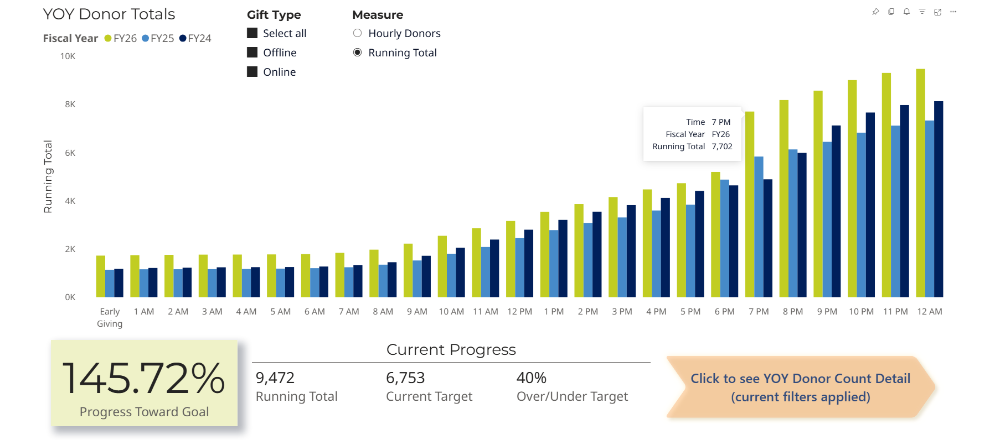{.lightbox}
:::
::: {.fragment .fade-in-then-out}
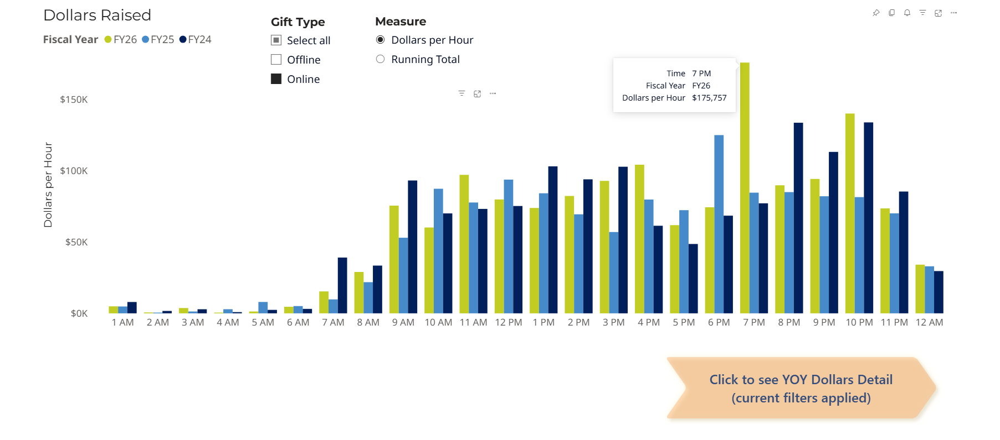{.lightbox}
:::
::: {.fragment .fade-in}
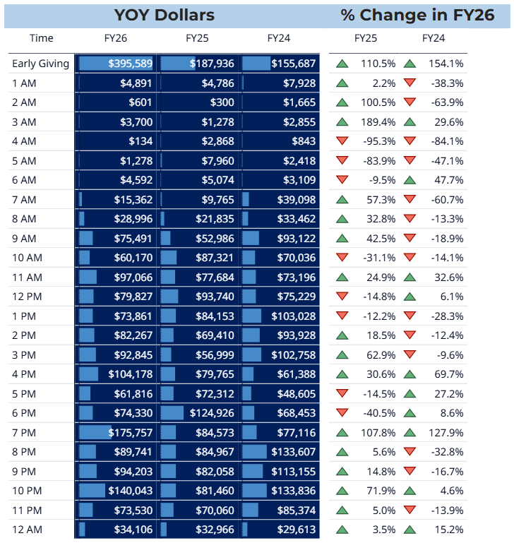{width=60% .lightbox}
:::
:::

## Villanova Annual Giving Year-To-Date Tracker

::: {.r-stack}
::: {.fragment .fade-in-then-out}
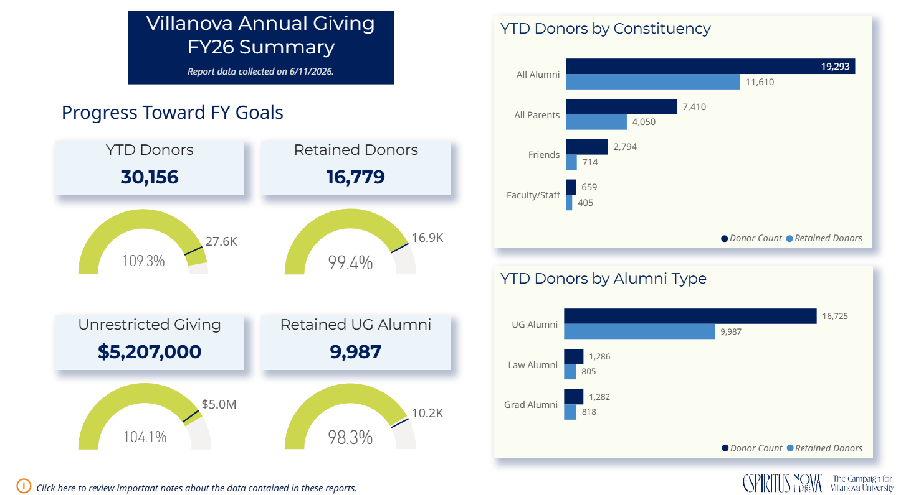{width=80% .lightbox}
:::
::: {.fragment .fade-in-then-out}
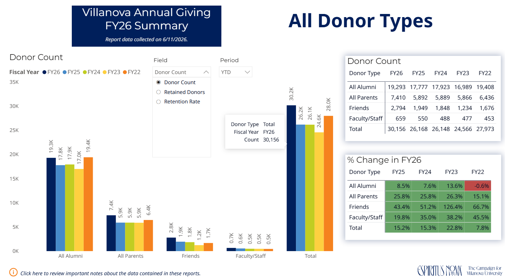{width=80% .lightbox}
:::
::: {.fragment .fade-in}
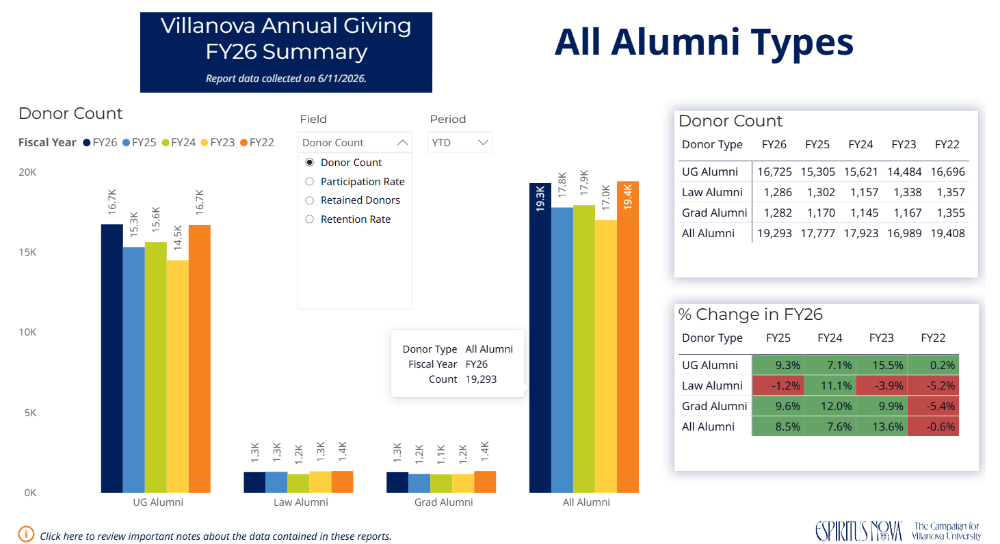{width=80% .lightbox}
:::
:::

## Pope Leo Christmas Ornament Progress

::: {.r-stack}
::: {.fragment .fade-in-then-out}
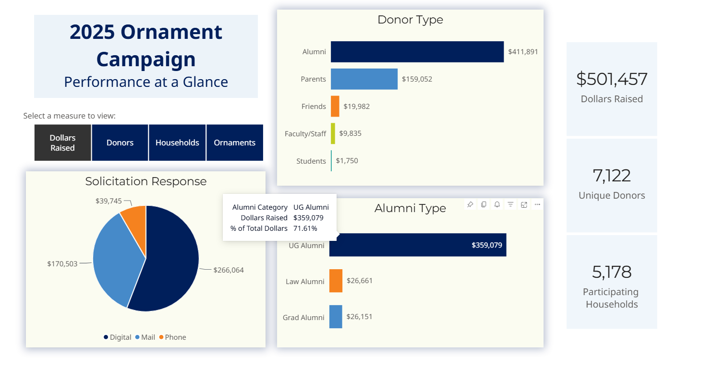{width=80% .lightbox}
:::
::: {.fragment .fade-in-then-out}
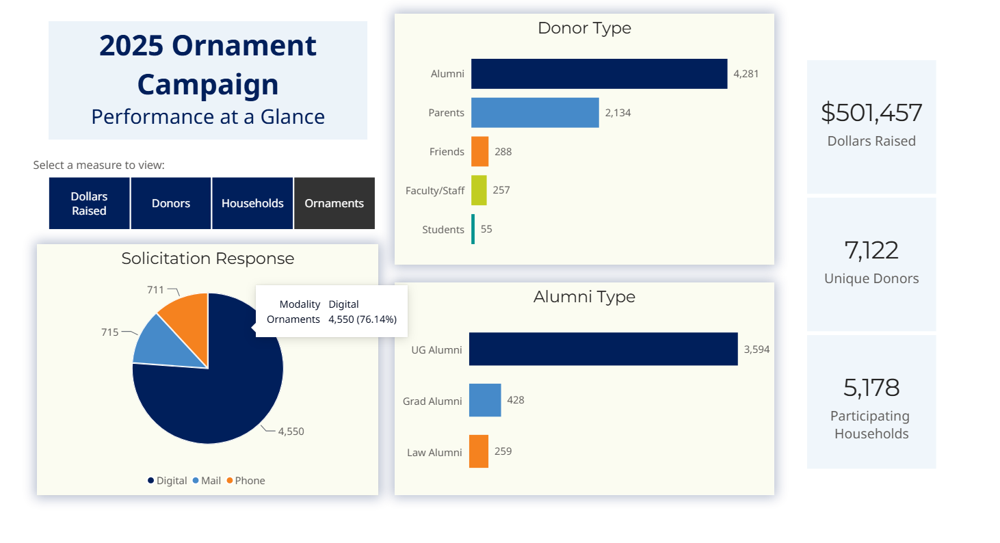{width=80% .lightbox}
:::
::: {.fragment .fade-in}
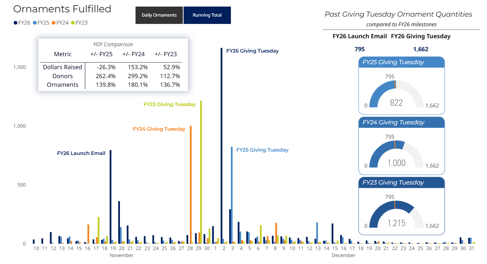{width=80% .lightbox}
:::
:::

<!-- # Application

## Our Sample Dataset

::: {.fragment}
**Synthetic Donor Dataset for Fundraising Analytics** [@donor_data]

- Developed as a capstone project by Danielle Brown, M.S. Computer Science, Loyola Marymount University
:::

. . .

<u>Why this dataset?</u>

:::: {.columns}
::: {.column width=50%}
::: {.fragment}
- Not real donors
  - No real PII being shared
:::

::: {.fragment}
- Robust and well-rounded
  - 50,000 donor records
  - 484,954 giving history records
:::
:::

::: {.column width=50%}
::: {.incremental}
- One of very few advancement-specific open-source synthetic datasets
- Good for practicing machine learning (ML) models with advancement data
- Contains data fields most development professionals would recognize
:::
:::
::::

```{r import-data}
#| echo: false
#| include: false

p_load(janitor)

## Read in datasets from GitHub
donors <- read_csv(
  'https://raw.githubusercontent.com/dbrown86/LMUCapstoneProject/refs/heads/main/data/synthetic_donor_dataset/donors.csv'
) %>%
  clean_names()

# relationships <- read_csv(
#     'https://raw.githubusercontent.com/dbrown86/LMUCapstoneProject/refs/heads/main/data/synthetic_donor_dataset/relationships.csv'
# ) %>%
#     clean_names()

giving_history <- read_csv(
  'https://raw.githubusercontent.com/dbrown86/LMUCapstoneProject/refs/heads/main/data/synthetic_donor_dataset/giving_history.csv'
) %>%
  clean_names()

# enhanced_fields <- read_csv(
#     'https://raw.githubusercontent.com/dbrown86/LMUCapstoneProject/refs/heads/main/data/synthetic_donor_dataset/enhanced_fields.csv'
# ) %>%
#     clean_names()
```

## Which Areas are US Regional Donors Supporting?

```{r}
#| echo: false
#| include: false
p_load(tidytext, scales, gghighlight)

regional_donors <- donors %>%
  left_join(giving_history, by = c('id' = 'donor_id')) %>%
  group_by(year, id) %>%
  mutate(med_AG = median(gift_amount)) %>%
  ungroup() %>%
  filter(
    last_gift != 0 &
      med_AG < 100000 &
      # lifetime_giving < 100000 &
      geographic_region %in% c('Northeast', 'Southeast') &
      primary_constituent_type == 'Alum' &
      !is.na(designation) &
      between(year, 2020, 2025)
  ) %>%
  group_by(
    gift_date,
    geographic_region,
    designation
  ) %>%
  mutate(
    dollars_raised = sum(gift_amount, na.rm = TRUE),
    donor_count = n_distinct(id)
  ) %>%
  ungroup()

designations <- regional_donors %>%
  ungroup() %>%
  select(designation) %>%
  unique()

ggplot(
  regional_donors %>%
    group_by(designation) %>%
    mutate(total_donors = sum(donor_count, na.rm = TRUE)) %>%
    ungroup(),
  aes(
    x = reorder(designation, -total_donors),
    y = total_donors
  )
) +
  geom_col()

ggplot(
  regional_donors,
  aes(x = gift_date, y = dollars_raised),
  col = designation
) +
  geom_line() +
  facet_wrap(~geographic_region)

geo_sum <- regional_donors %>%
  group_by(designation, geographic_region) %>%
  summarize(total = sum(dollars_raised, na.rm = TRUE))
```
 -->

# Case Studies

## Medication Effectiveness

::: {.notes}
- Along the vertical axis, we have the concentration of the medication in the blood
- x-axis is time
- So this is telling us how long the medication is in your bloodstream and ostensibly providing the intended effects
- Given that, how would you describe what's happening to the drug concentration in the bloodstream in these two charts?
- the chart on the right makes it seem like it works better, longer
:::

These two charts are based on the same blood plasma concentration data...

:::: {.columns}
::: {.column width=50%}
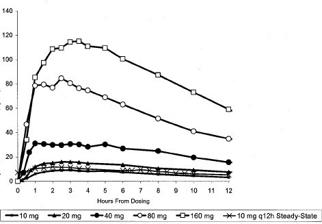{fig-align="center" width=90% .lightbox}
:::

::: {.column width=50%}
::: {style="text-align: right;"}
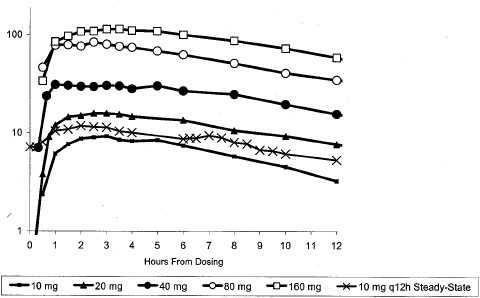{fig-align="center" width=90% .lightbox}

*[...but they tell two different stories.]{.fragment}*
:::
:::
::::

[**What do you notice?**]{.fragment .fade-in-then-out} **[Any guesses as to which medication this is?]{.fragment .fade-in .highlight-orange}**

## [Medication Effectiveness]{.fragment .strike .semi-fade-out fragment-index="0"} [Drug Addictiveness]{.fragment .fade-in fragment-index="0"}

::: {.fragment .fade-in fragment-index="0"}
:::: {.columns}
::: {.column width=50%}
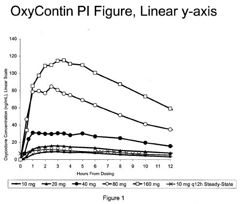{fig-align="center" width=90%}
:::

::: {.column width=50%}
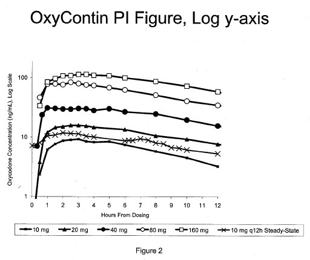{fig-align="center" width=90%}
:::
::::
:::

::: {.r-stack}
::: {style="text-align: center;"}
::: {.fragment .fade-in-then-semi-out}
Can you guess which chart Purdue Pharma used in their prescription information materials from December 1995 until August 2010?
:::
:::
:::

##

::: {.notes}
- 2008 petition to the FDA to compel Purdue Pharma to cease using the misleading log scale graph
- "Beginning on or about December 12, 1995, and continuing until on or about June 30, 2001, certain Purdue supervisors and employees, with the intent to defraud or mislead, marketed and promoted OxyContin as less addictive, less subject to abuse and diversion, and less likely to cause tolerance and withdrawal than other pain medications"
:::

::: {style="text-align: center; font-size: 150%;"}
***[Data matters. How you represent it matters, too.]{.highlight-orange}***
:::

:::: {.columns}
::: {.column width=50%}
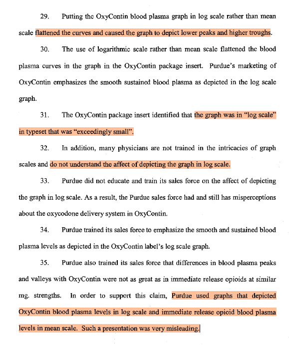{fig-align="center" width=75% .lightbox}
:::

::: {.column width=50%}
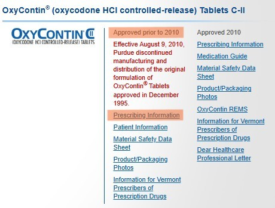{width=60% .lightbox}

{width=100% .lightbox}
:::
::::

## The Curious Conundrum of the Baltic Giantess(?)

::: {.notes}
-	Pink? For women? Groundbreaking. Did this graph also cost 7% more to produce?
  - If you're unfamiliar with the pink tax and want something to be mad about, look it up
-	The pink, the figure in the dress, the font: frankly, it’s a little ham-fisted with the “girly” motif, and I personally find it to be kind of pandering and reductive
-	Think about the audience: is this the kind of visualization you’d want to share in a business meeting? Probably not!
-	There’s nothing wrong with a silly or even a cheeky visual—there’s a time and a place for everything—but you want your audience to feel like their time and comprehension skills are being respected
:::

. . .

:::: {.columns}
::: {.column width=50%}
::: {style="text-align: center;"}
](./avg_fem_height.png){fig-align="center" width=90%}
:::
:::

::: {.column width=50%}
[What's...*unpolished* about this?]{.fragment}

::: {.fragment}
- Scale is misleading
  - Vertical axis doesn't start at 0
- Column shapes are distracting
  - Overlap creates visual clutter
- Value of color is unclear
  - Hue/saturation appears random
:::

::: {style="text-align: center; font-size: 150%;"}
***[Let's talk about audience.]{.fragment .highlight-pink}***
:::
:::
::::

# Parting Thoughts

## The Artificial Intelli-phant in the Room

::: {style="text-align: center; font-size: 150%;"}
**[<u>Can't AI do all this for me</u>?]{.fragment .highlight-orange}**
:::

. . .

Well,

::: {style="text-align:center;"}
[AI can do a lot of things for you.]{.fragment .highlight-orange}*[..with varying degrees of success and/or quality.]{.fragment .highlight-orange}*
:::

::: {.incremental}
- It's 2026. AI is everywhere---so yes, you absolutely could have AI create visuals for you.
  - AI can be a valuable tool when it comes to data analysis and coding visualizations, but beware of black box analysis.
  - Validating AI output requires familiarity *beyond* just the basics of data viz.
- The quality of the input corresponds to the quality of the output.
  - Describing the details of your business problem and your request in a way that AI will understand is the foundation of good prompt engineering.
- AI raises the floor for new learners and raises the ceiling for experts.
:::

## Toward Good Data Stewardship

::: {.notes}
- Skewing, exaggerating, omitting, or otherwise misrepresenting data can have very material consequences, like the $7.4B national opioid settlement Purdue pharma and the Sackler family are on the hook for
- Unless you’re a very confident and adept liar, you do NOT want to be put in this position
- Even if you're be under pressure to appease stakeholders and show them what they *want* to see:
  - Without the complete picture, we can’t make data-driven decisions like informed strategic pivots, and this ultimately hampers progress and works against organizational goals and stakeholder interests.
:::

::: {style="text-align: center; font-size: 150%;"}
**[<u>Transparency fosters trust</u>.]{.fragment .highlight-orange}**
:::

::: {.incremental}
- As data storytellers, our prime directive should be to accurately and honestly represent our data.
- Perceptive audiences *will* poke holes in visualizations that don't add up.
- Where data comes from can feel like a black box for non-specialists---be someone that you'd want to put your faith in.
- It's better to have the full picture than a convenient snippet---both strategically *and* ethically.
:::

## Let's Keep in Touch!
```{r qr-contact}
#| echo: false
#| include: false

contact_card <- qr_vcard(
  given = 'Kevin',
  family = 'Madden',
  email = c(work = 'kevin.madden@villanova.edu'),
  telephone = c(work = '610-519-7881'),
  organisation = 'Villanova University',
  job_title = 'Assistant Director of Annual Giving',
  photo = 'https://github.com/kfmadden/the-last-byte/blob/main/Kevin%20Madden_headshot.jpg?raw=true'
)

png(filename = 'KM_contact_card.png', bg = 'transparent')
par(mar = c(0, 0, 0, 0), oma = c(0, 0, 0, 0), xaxs = 'i', yaxs = 'i')
plot(contact_card, col = c('#282a36', '#f8f8f2'), main = NA)
dev.off()
```

If you have any questions for me, feedback about my presentation, or requests for additional resources---including this slide deck---please reach out!

:::: {.columns}
::: {.column width='40%'}
::: {style='text-align: center;'}
](./KM_contact_card.png){width=250 height=250}
:::
:::

::: {.column width='60%'}
🙂 <u>Things I'm always happy to chat about</u> 👇

:::: {.columns}
::: {.column width='40%'}
::: {style='text-align: center;'}
📊 Data

💻 Coding

🧁 Baking
:::
:::

::: {.column width='40%'}
::: {style='text-align: center;'}
🎾 Tennis

📖 Book Recs

🐱 Your Pets
:::
:::
::::
:::
::::

## References
::: {refs}
:::